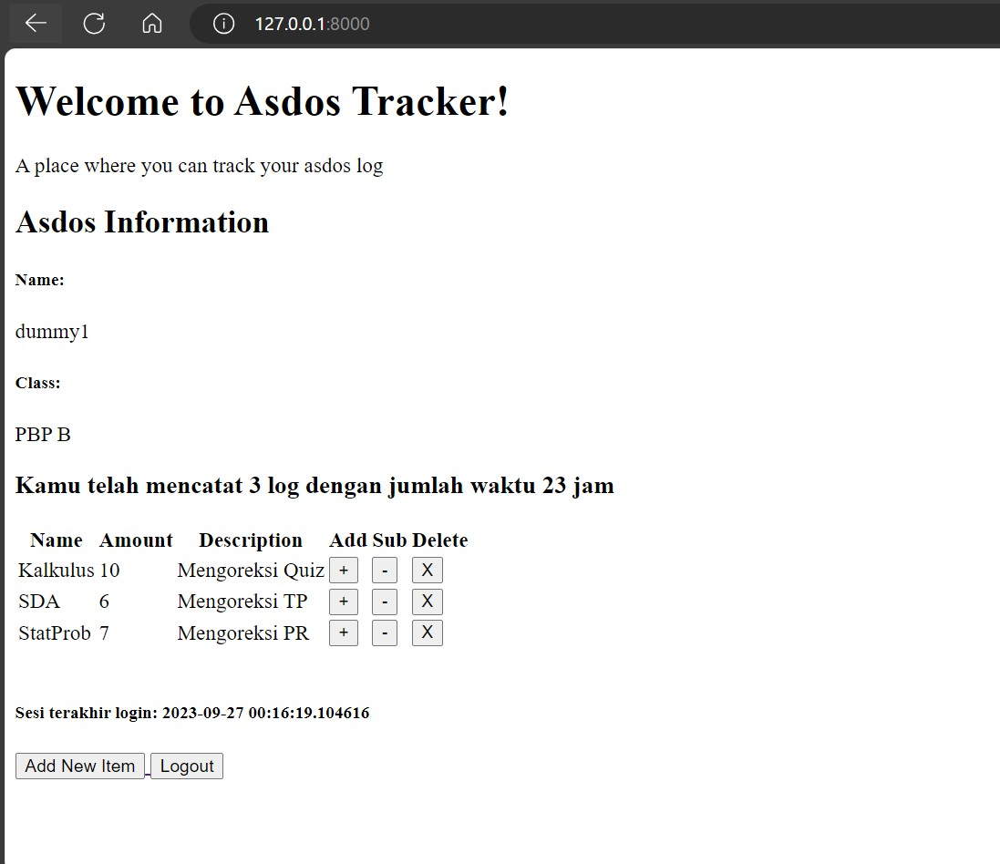
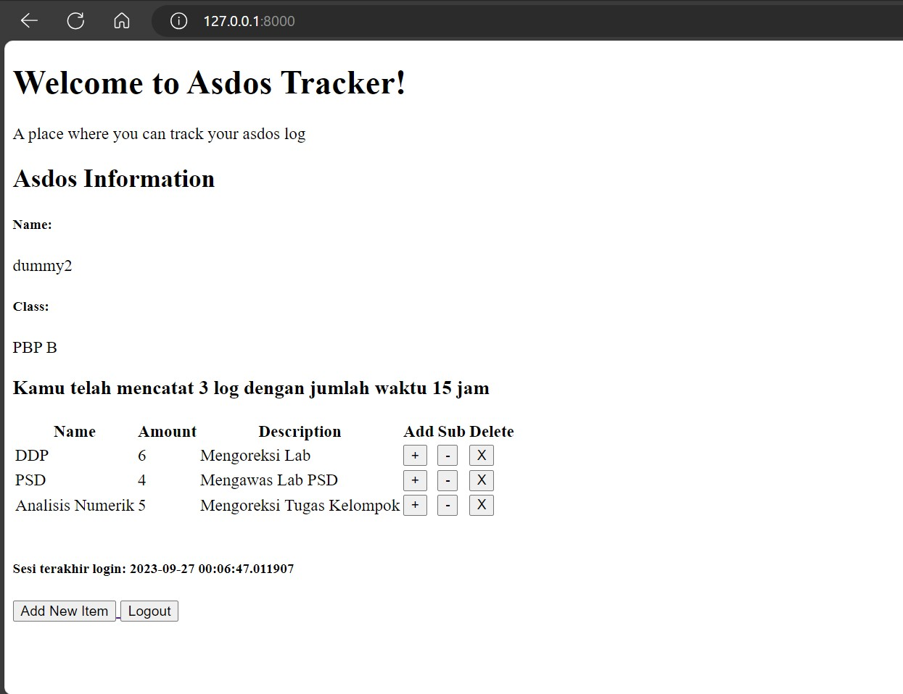
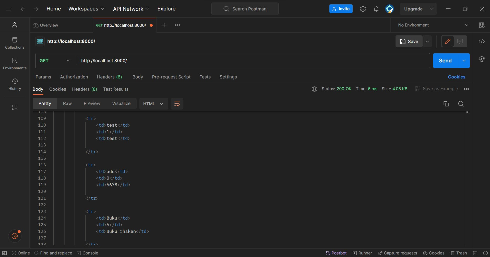
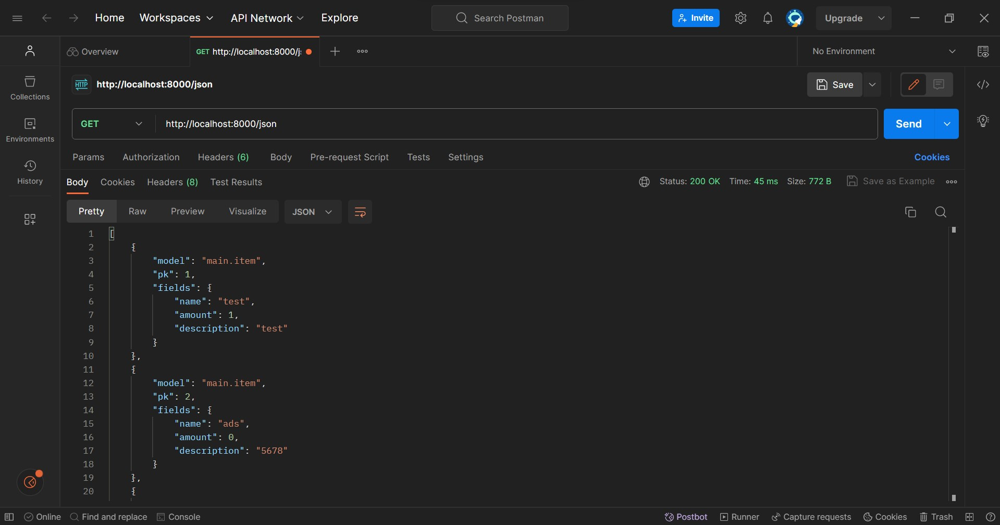
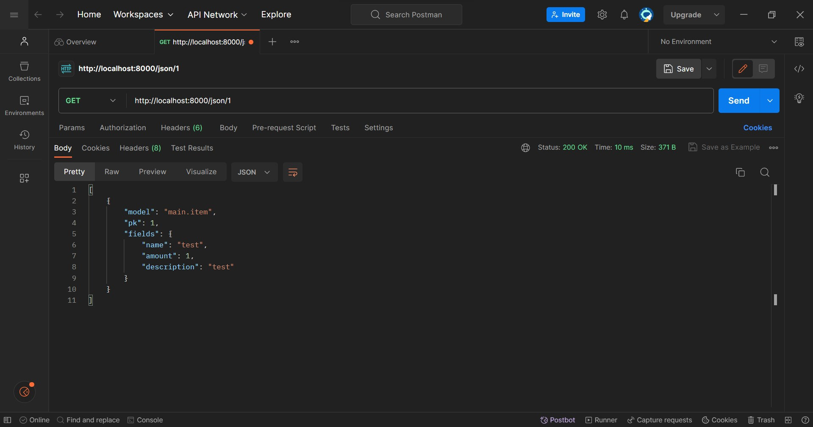
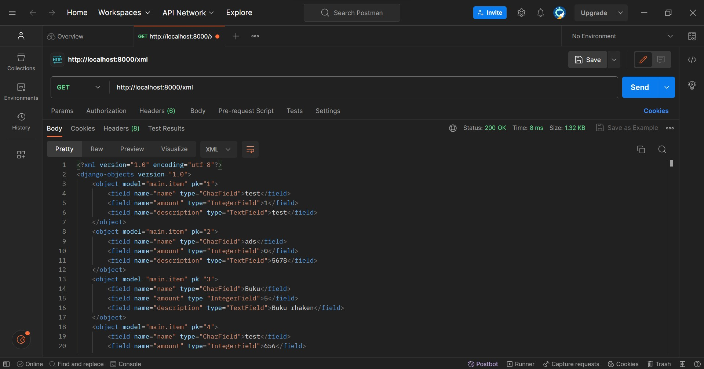
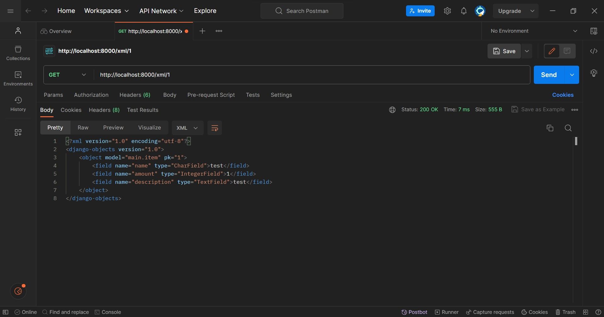
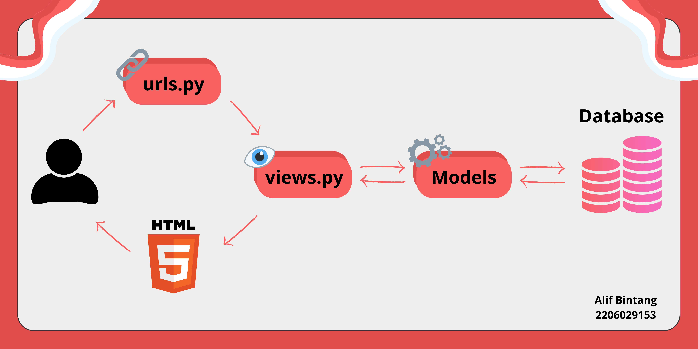

# Tugas 5
## Implementasi

## Manfaat Element Sector dan Waktu Penggunaannya
### 1. Element Sector
Element selector digunakan untuk memilih semua elemen dengan tipe tertentu dalam dokumen HTML, baik digunakan ketika ingin menerapkan gaya umum ke seluruh tipe elemen tertentu dalam dokumen.
### 2. ID Selector
ID selector digunakan untuk memilih elemen berdasarkan atribut id yang unik, digunakan ketika perlu merujuk ke elemen tertentu dalam dokumen dan tahu bahwa elemen tersebut memiliki atribut id yang unik
### 3. Class Selector
Class selector digunakan untuk memilih elemen berdasarkan atribut class yang diberikan, digunakan ketika ingin menerapkan gaya yang sama atau fungsi yang sama pada beberapa elemen dalam dokumen.

## HTML5 Tag
HTML5 adalah versi terbaru dari bahasa markup HTML (Hypertext Markup Language) yang digunakan untuk membuat halaman web. HTML5 menyediakan sejumlah tag (elemen) baru yang memungkinkan saya untuk membuat konten website yang lebih interaktif.
<nav>: untuk menentukan area navigasi atau menu di dalam halaman web.
<article>: untuk mengelompokkan konten yang berdiri sendiri atau independen, seperti berita, posting blog, atau artikel.
<canvas>: untuk membuat grafik, gambar, dan animasi yang dapat digambar dan dimanipulasi menggunakan JavaScript.
<audio> dan <video>: untuk mendukung media audio dan video yang lebih baik.

## Perbedaan antara _margin_ dan _padding_
Baik margin dan padding sama-sama memiliki fungsi untuk mengatur tata letak. Perbedaan utamanya adalah margin merupakan ruang antara elemen tersebut dan elemen-elemen lain yang ada di sekitarnya, sedangkan padding adalah ruang di dalam batas elemen di antara kontennya dan batasnya sendiri. Selain itu, margin dapat memengaruhi tata letak elemen-elemen di seluruh halaman web, sementara padding tidak akan memengaruhi tata letak elemen-elemen lain di luar elemen yang memiliki padding.

## Perbedaan _framework_ CSS Tailwind dan Bootstrap
Bootstrap adalah framework CSS yang lebih tradisional, menyediakan sejumlah komponen siap pakai, seperti tombol, jumbotron, dan navigasi, yang memudahkan pengembangan web yang cepat. Bootstrap memiliki gaya bawaan yang khas yang dapat mengarah pada desain yang serupa di banyak situs web.

Tailwind CSS adalah framework CSS yang lebih modern dan berbasis utility class. saya membangun tampilan dengan menggabungkan kelas-kelas yang telah ditentukan sebelumnya untuk mengatur tata letak, warna, dan gaya elemen-elemen. Ini memberikan fleksibilitas yang besar dan memungkinkan untuk mengontrol setiap aspek desain dengan sangat rinci.

Jadi, singkatnya, gunakan Bootstrap jika ingin pengembangan cepat dengan desain yang mirip-mirip dan gunakan Tailwind jika ingin fleksibilitas maksimum dalam menentukan desain situs web.

# Tugas 4
## Implementasi
### 1. Membuat Fungsi Registrasi
Dengan memanfaatkan UserCreationForm (formulir bawaan), pengguna baru dapat mendaftar dengan mudah di situs web saya tanpa harus menulis kode dari awal. Saya lalu membuat fungsi untuk register
```python
def register(request):
    form = UserCreationForm()

    if request.method == "POST":
        form = UserCreationForm(request.POST)
        if form.is_valid():
            form.save()
            messages.success(request, 'Your account has been successfully created!')
            return redirect('main:login')
    context = {'form':form}
    return render(request, 'register.html', context)
```
Fungsi itu dibuat sedemikian sehingga setelah berhasil mendaftar, pengguna akan diarahkan ke halaman login.

Selanjutnya, tentu saya perlu membuat HTML untuk menampilkan form registrasinya yang akan saya taruh di `main/templates`
```html



    <title>Register</title>


  

<div class = "login">
    
    <h1>Register</h1>  

        <form method="POST" >  
              
            <table>  
                {{ form.as_table }}  
                <tr>  
                    <td></td>
                    <td><input type="submit" name="submit" value="Daftar"/></td>  
                </tr>  
            </table>  
        </form>

      
        <ul>   
              
                <li>{{ message }}</li>  
                  
        </ul>   
    

</div>  


```
### 2. Membuat Fungsi Login
Dengan mengimport _authenticate_ dari Django, user yang melakukan login akan diautentikasi secara otomatis. Saya tinggal memanfaatkan fungsi itu pada fungsi login saya
```python
def login_user(request):
    if request.method == 'POST':
        username = request.POST.get('username')
        password = request.POST.get('password')
        user = authenticate(request, username=username, password=password)
        if user is not None:
            login(request, user)
            return redirect('main:show_main')
        else:
            messages.info(request, 'Sorry, incorrect username or password. Please try again.')
    context = {}
    return render(request, 'login.html', context)
```
Sama seperti tadi, saya perlu membuat HTML-nya untuk menampilkan page login
```html



    <title>Login</title>




<div class = "login">

    <h1>Login</h1>

    <form method="POST" action="">
        
        <table>
            <tr>
                <td>Username: </td>
                <td><input type="text" name="username" placeholder="Username" class="form-control"></td>
            </tr>
                    
            <tr>
                <td>Password: </td>
                <td><input type="password" name="password" placeholder="Password" class="form-control"></td>
            </tr>

            <tr>
                <td></td>
                <td><input class="btn login_btn" type="submit" value="Login"></td>
            </tr>
        </table>
    </form>

    
        <ul>
            
                <li>{{ message }}</li>
            
        </ul>
         
        
    Don't have an account yet? <a href="">Register Now</a>

</div>


```
Perhatikan pula bahwa saya juga dapat pindah ke halaman register jika masih belum punya akun.

### 3. Membuat Fungsi Logout
Saya membuat fungsi logout terlebih dahulu, yang akan mendelete cookies jika user telah logout.
```python
def logout_user(request):
    logout(request)
    return redirect('main:login')
```
Saya tidak perlu membuat page logout (karena ketika user logout akan dikembalikan ke halaman login). Jadi, saya tinggal perlu membuat button untuk logout saja di `main.html`.
```html
<a href="">
    <button>
        Logout
    </button>
</a>
```

### 4. Menghubungkan Model Item dan User
Untuk menghubungkan User dengan Item pada Django, saya menggunakan interface User pada django.contrib.auth.models. _Code_ ini menghubungkan satu produk dengan satu User melalui sebuah relationship, dimana sebuah produk pasti terasosiasikan dengan seorang User.
```python
class Item(models.Model):
    user = models.ForeignKey(User, on_delete=models.CASCADE)

    name = models.CharField(max_length=255)
    amount = models.IntegerField()
    description = models.TextField()
```
Lalu, saya perlu memodif fungsi `create_item` yang ada pada `views.py`.
```python
def create_item(request):
    form = ItemForm(request.POST or None)

    if form.is_valid() and request.method == "POST":
        item = form.save(commit=False)
        item.user = request.user
        item.save()
        return HttpResponseRedirect(reverse('main:show_main'))

    context = {'form': form}
    return render(request, "create_item.html", context)
```
Parameter `commit = False` adalah agar objek tidak langsung tersimpan ke database. Hal tersebut memungkinkan kita untuk memodifikasi terlebih dahulu objek tersebut sebelum disimpan ke database. Pada kasus ini, kita akan mengisi field user dengan objek User dari return value request.user yang sedang terotorisasi untuk menandakan bahwa objek tersebut dimiliki oleh pengguna yang sedang login. 

### 5. Menampilkan Informasi Pengguna dan Menerapkan _Cookies_
Untuk menampilkan informasi pengguna yang sudah login, saya akan menambahkan _cookies_ untuk melihat kapan terakhir kali user melakukan login. Caranya adalah dengan sedikit memodif pada fungsi `login_user`.
```python
...

if user is not None:
    login(request, user)
    response = HttpResponseRedirect(reverse("main:show_main")) 
    response.set_cookie('last_login', str(datetime.datetime.now()))
    return response

...  
```
Saya juga perlu menambah variabel pada context, yaitu `'last_login': request.COOKIES['last_login']`, dan perlu memodif pada fungsi `logout_user`.
```python
def logout_user(request):
    logout(request)
    response = HttpResponseRedirect(reverse('main:login'))
    response.delete_cookie('last_login')
    return response
```
Terakhir, pada `main.html`, waktu terakhir login akan disimpan pada variabel `last_login` dan saya tinggal menampilkannya.

## Dummy Account



## Penjelasan Django UserCreationForm
Django UserCreationForm adalah sebuah form bawaan yang disediakan oleh framework web Python Django. Form ini digunakan untuk memudahkan proses pembuatan pengguna (user) dalam aplikasi web yang menggunakan Django. UserCreationForm secara khusus dirancang untuk membuat dan mendaftarkan pengguna baru dengan mengumpulkan informasi yang diperlukan seperti nama pengguna _username_ dan _password_. Jika informasi yang dimasukkan sesuai, UserCreationForm akan membuat objek pengguna baru dan menyimpannya dalam _database_ Django.

Kelebihan dari form ini adalah tingkat simplisitasnya yang mudah, dan juga menyediakan validasi bawaan untuk memastikan bahwa informasi yang diinputkan oleh pengguna sesuai dengan persyaratan yang telah ditentukan, seperti ketentuan panjang kata sandi atau tingkat kerumitan kata sandi.

Kekurangannya adalah tampilan bawaannya yang mungkin tidak sesuai dengan aplikasi, serta untuk aplikasi yang sensitif terhadap keamanan mungkin memerlukan lapisan keamanan tambahan.

## Perbedaan antara Autentikasi dan Otorisasi dalam Konteks Django
Autentikasi dan otorisasi adalah dua konsep yang berhubungan, berperan dalam mengelola akses pengguna ke aplikasi. Keduanya penting karena berperan sebagai kunci dalam menjaga keamanan, privasi, dan pengelolaan akses pengguna
### Autentikasi
Autentikasi adalah proses verifikasi identitas pengguna yang ingin masuk ke aplikasi, biasanya dengan menggunakan _username_ dan _password_. Setelah autentikasi berhasil, Django akan memberikan akses ke area yang sesuai dalam aplikasi berdasarkan _role_ pengguna, disebut juga otorisasi.
### Otorisasi
Otorisasi adalah proses menentukan apa yang diizinkan oleh pengguna yang telah diautentikasi. Ini mengontrol akses ke konten atau tindakan tertentu dalam aplikasi. Django akan memeriksa izin pengguna untuk memastikan mereka memiliki izin yang diperlukan untuk melakukan hal tersebut. Jika pengguna memiliki izin yang sesuai, mereka diizinkan untuk melakukannya; jika tidak, mereka akan ditolak akses.

## Penjelasan tentang _Cookies_
Cookies dalam konteks aplikasi web adalah file kecil yang digunakan untuk menyimpan informasi pada perangkat pengguna. Mereka digunakan untuk menyimpan informasi khusus pada perangkat pengguna, seperti data sesi, preferensi, atau informasi lain yang relevan untuk pengalaman pengguna.Django menggunakan cookies untuk mengelola data sesi pengguna, seperti ID sesi, yang memungkinkan aplikasi web untuk menjaga status sesi pengguna.

## Keamanan _Cookies_
Penggunaan cookies dalam pengembangan web secara default cenderung aman, karena mereka digunakan untuk menyimpan data sesi atau preferensi pengguna, memungkinkan pengalaman pengguna yang lebih baik. Namun, ada risiko potensial yang perlu diwaspadai, terutama terkait dengan cookies pihak ketiga yang dapat digunakan untuk melacak aktivitas pengguna secara online tanpa izin mereka. Hal ini dapat mengancam privasi pengguna dan memicu masalah keamanan jika data yang disimpan dalam cookies tersebut disalahgunakan.

# Tugas 3
## Implementasi
### 1. Membuat Input Form
Membuat `forms.py` pada direktori APP (dalam hal ini adalah `main`) dengan isi:
```python
from django.forms import ModelForm
from main.models import Item

class ItemForm(ModelForm):
    class Meta:
        model = Item
        fields = ['name', 'amount', 'description']
```
Setelah itu, saya membuat fungsi `create_item` untuk membuat formulir yang dapat secara otomatis menambahkan data produk yang disubmit pada `create_item.html`
```python
def create_item(request):
    form = ItemForm(request.POST or None)

    if form.is_valid() and request.method == "POST":
        form.save()
        return HttpResponseRedirect(reverse('main:show_main'))

    context = {'form': form}
    return render(request, "create_item.html", context)
```
Lalu, saya membuat file `create_item.html` yang diletakkan di direktori `templates`, file ini adalah tampilan form kepada user, dan user dapat memasukkan data yang diinginkan
```html
 


<h1>Add New Item</h1>

<form method="POST">
    
    <table>
        {{ form.as_table }}
        <tr>
            <td></td>
            <td>
                <input type="submit" value="Add Item"/>
            </td>
        </tr>
    </table>
</form>


```

Tidak lupa, saya tambahkan path nya pada `urls.py` di direktori `main`
```python
path('create-product', create_item, name='create_item'),
```

### 2. Menampilkan Objek yang Ditambahkan (dalam Format HTML, XML, JSON, XML by ID, dan JSON by ID)
#### HTML
Karena dalam pengerjaan ini saya ingin menampilkan objeknya pada halaman utama, maka saya perlu memodifikasi fungsi `show_main` pada `views.py` agar data produk dapat ditampilkan.
```python
def show_main(request):
    items = Item.objects.all()
    context = {
        'name': 'Alif Bintang Elfandra',
        'class': 'PBP B',
        'items': items, # Modifikasi di sini
    }

    return render(request, "main.html", context)
```
Saya juga perlu melakukan sedikit modifikasi pada `main.html` untuk menampilkan objeknya.
```html
...
<!-- Untuk menampilkan tabel -->
<table>
    <tr>
        <th>Name</th>
        <th>Amount</th>
        <th>Description</th>
    
    </tr>

     Berikut cara memperlihatkan data produk di bawah baris ini 

    
        <tr>
            <td>{{item.name}}</td>
            <td>{{item.amount}}</td>
            <td>{{item.description}}</td>
            
        </tr>
    
</table>

<br />

<!-- Untuk button Add New Item -->
<a href="">
    <button>
        Add New Item
    </button>
</a>
```


#### XML dan JSON
Saya menambahkan fungsi `show_xml` dan `show_json` yang akan return HttpResponse berisi data yang sudah diserialize menjadi XML dan JSON.
```python
def show_xml(request):
    data = Item.objects.all()
    return HttpResponse(serializers.serialize("xml", data), content_type="application/xml")

def show_json(request):
    data = Item.objects.all()
    return HttpResponse(serializers.serialize("json", data), content_type="application/json")
```

#### XML dan JSON (by ID)
Untuk ini, mirip seperti yang nomor 2, hanya saja sekarang saya hanya akan menampilkan barang sesuai ID saja.
```python
def show_xml_by_id(request, id):
    data = Item.objects.filter(pk=id)
    return HttpResponse(serializers.serialize("xml", data), content_type="application/xml")

def show_json_by_id(request, id):
    data = Item.objects.filter(pk=id)
    return HttpResponse(serializers.serialize("json", data), content_type="application/json")
```


### 3. Membuat _Routing_ URL
Untuk setiap fungsi pada `views.py` yang ditambahkan, saya perlu menambahkan path nya pada `urls.py`. Hasil akhirnya, file `urls.py` pada direktori `main` akan berisi:
```python
from django.urls import path
from main.views import show_main, create_item, show_xml, show_json, show_xml_by_id, show_json_by_id 

app_name = 'main'

urlpatterns = [
    path('', show_main, name='show_main'),
    path('create-product', create_item, name='create_item'),
    path('xml/', show_xml, name='show_xml'),
    path('json/', show_json, name='show_json'), 
    path('xml/<int:id>/', show_xml_by_id, name='show_xml_by_id'),
    path('json/<int:id>/', show_json_by_id, name='show_json_by_id'), 
]
```

## Perbedaan Form POST dan GET
Perbedaan utamanya adalah terletak pada URL-nya.
Pada GET, data/variabel akan ditampilkan pada URL, sebaliknya pada POST, data/variabel tidak akan ditampilkan di URL.

GET tidak cocok bila digunakan untuk mengirim data-data penting, contohnya seperti password. Namun, user dapat dengan mudah memasukkan variabel baru, jadi cocok untuk mengirim data-data yang tidal terlalu penting/tidak rahasia.

POST cenderung lebih aman, dan dapat digunakan untuk mengirim data-data penting. Panjang string URL pun tidak dibatasi. Namun, POST kurang efisien bila data yang dikirim adalah data-data yang tidak penting.
## Perbedaan XML, JSON, dan HTML dalam Pengiriman Data
XML (eXtensible Markup Language) menggunakan sintaks berbasis tag (mirip seperti HTML). Ini memungkinkan untuk mendefinisikan struktur data yang sangat fleksibel dan kompleks, tetapi jadi lebih sulit dibaca oleh manusia. XML dirancang untuk menjadi format data yang digunakan oleh komputer dan aplikasi, bukan untuk keterbacaan manusia. 

HTML (Hypertext Markup Language) adalah bahasa yang digunakan untuk membangun tampilan web dan memiliki tujuan utama untuk mengorganisasi dan menampilkan konten di browser. Ini memiliki struktur dasar yang berbeda dan **biasanya tidak digunakan untuk pengiriman data** dalam konteks yang sama seperti XML atau JSON. HTML digunakan untuk tujuan yang berbeda dan memiliki fokus utama pada tampilan dan interaksi dengan pengguna.

JSON (JavaScript Object Notation) adalah adalah format data yang digunakan untuk mengirim dan menyimpan informasi dalam bentuk teks yang mudah dibaca oleh manusia dan mudah diproses oleh komputer. JSON umum digunakan dalam pengembangan web dan aplikasi, khususnya dalam pertukaran data antara browser dan server, karena komunikasi web umumnya berbasis JavaScript.


## Pentingnya JSON dalam Pertukaran Data antara Aplikasi Web Modern
* JSON menggunakan sintaks yang lebih sederhana dan mudah dibaca oleh manusia, menggunakan struktur List dan Dictionary pada Python.

* JSON memiliki overhead (jumlah karakter) yang lebih kecil dibandingkan dengan XML dan HTML, sehingga memerlukan lebih sedikit sumber daya untuk mengurai data

* JSON  didukung untuk mengurai dan menghasilkan data oleh banyak bahasa pemrograman. Ini memungkinkan aplikasi yang ditulis dalam bahasa yang berbeda untuk berkomunikasi dengan mudah dan mempertukarkan data dengan format yang sama.

## Screenshot Postman
### 1. HTML

### 2. JSON

### 3. JSON by ID

### 4. XML

### 5. XML by ID



# Tugas 2
## Implementasi
Sebelum memulai, perlu diperhatikan bahwa semua perintah yang dijalankan di _command prompt_ harus berada di direktori utama proyek.
### 1. Membuat proyek Django baru
Saya membuat direktori baru bernama `asdos_tracker`, lalu menambahkan berkas `requirements.txt` di dalam direktori tersebut yang berisi:
```
django
gunicorn
whitenoise
psycopg2-binary
requests
urllib3
```
Berkas itu berisi _dependencies_ yang akan digunakan. Sebelum memasang _dependencies_, saya membuat _virtual environment_ dengan perintah `python -m venv env` dan mengaktifkannya dengan perintah `env\Scripts\activate.bat`.
Lalu, saya memasang _dependencies_ dengan perintah `pip install -r requirements.txt`.
Terakhir, untuk membuat proyek baru, jalankan perintah `django-admin startproject asdos-tracker .`. Perintah itu akan membuat direktori proyek baru (beserta dengan berkas-berkas yang dibutuhkan) di dalam direktori utama saya.

### 2. Membuat aplikasi `main` pada proyek tersebut
Jalankan perintah `python manage.py startapp main` untuk membuat aplikasi dengan nama `main`. Lalu, setiap saya menambahkan aplikasi, saya harus mendaftarkan aplikasinya ke dalam proyek. Caranya adalah dengan membuka berkas `settings.py` di dalam direktori proyek, lalu memodifikasi di variabel `INSTALLED_APPS`.
```python
INSTALLED_APPS = [
    ...,
    'main',
    ...
]
```

### 3. Melakukan _routing_ agar dapat menjalankan aplikasi
Saya membuat `urls.py` di dalam direktori `main` yang berisi:
```python
from django.urls import path
from main.views import show_main

app_name = 'main'

urlpatterns = [
    path('', show_main, name='show_main'),
]
```
Berkas ini berguna untuk mengatur rute URL yang terkait pada aplikasi `main`.
Untuk mengimport rute URL dari aplikasi `main` ke dalam `urls.py` proyek, maka buka berkas `urls.py` yang ada di dalam direktori proyek, lalu modifikasi _code_-nya menjadi seperti ini:
```python
...
from django.urls import path, include
...
urlpatterns = [
    ...
    path('main/', include('main.urls')),
    ...
]
```

### 4. Membuat model pada aplikasi `main`
Saya membuka `models.py` yang ada di direktori aplikasi, lalu mengisinya dengan _code_ berikut:
```python
from django.db import models

class Item(models.Model):
    name = models.CharField(max_length=255)
    amount = models.IntegerField()
    description = models.TextField()
```
Nama model saya adalah _Item_ yang mempunyai atribut-atribut _name, amount,_ dan _description_. Setiap atribut/_field_ memiliki tipe data yang sesuai, yaitu _CharField, IntegerField,_ dan _TextField_. Lalu, setiap saya mengubah model, saya melakukan migrasi model untuk melacak perubahan pada model basis data saya. Hal itu dilakukan dengan cara menjalankan perintah `python manage.py makemigrations`, setelah itu `python manage.py migrate`.

### 5. Membuat fungsi pada `views.py`
Untuk menentukan tampilan apa yang akan saya lihat di `http://localhost:8000/main`, saya membuat direktori `templates` pada direktori aplikasi `main`. Di dalam direktori tersebut, saya menambahkan berkas `main.html` berisi _HTML code_ yang ingin saya tampilkan. Pada `views.py`, saya dapat mengembalikan `main.html` tesebut dengan memodifikasi _code_ menjadi seperti:
```python
from django.shortcuts import render

# Create your views here.
def show_main(request):
    context = {
        'name': 'Alif Bintang Elfandra',
        'class': 'PBP B'
    }
    return render(request, "main.html", context)
```

### 6. Melakukan _deployment_
Pada adaptable, pilih opsi _deploy a new app_. Karena saya ingin men-_deploy_ _repository_ `asdos-tracker`, maka saya memilih _repository_ tersebut. Pilih _Python App Template_ sebagai _template deployment_. Selanjutnya adalah opsi tipe _database_, pilih PostgreSQL. Sesuaikan versi python dengan versi lokal. Dan masukan `python manage.py migrate && gunicorn asdos_tracker.wsgi` pada _Start Command_. Tentukan nama applikasi dan checklist _HTTP Listener on PORT_.

## Bagan

_Client_ meminta untuk membuka suatu situs kepada _browser_, yang akan mengirimkan HTTP _request_, lalu diteruskan ke sistem _routing_ dan mencari pola URL yang sesuai dengan permintaan _client_. Django akan memanggil fungsi yang terkait dalam berkas `views.py` yang telah terhubung dengan URL tersebut. `views.py` akan mengambil data yang dibutuhkan pada `models.py`. Setelah itu, `views.py` akan mengirimkan _webpage_ dalam bentuk HTML yang terdapat pada direktori `templates`. Terakhir, HTTP _request_ akan dikembalikan oleh view menjadi HTTP _response_ berupa HTML _page_.

## Virtual Environment
Fungsi _virtual environment_ adalah untuk memisahkan _packages_ dan _dependencies_ untuk setiap proyek kita, sehingga setiap proyek kita dapat menggunakan paket _Python_ yang berbeda-beda. Kita sebenarnya bisa saja membuat proyek tanpa _virtual environment_, tetapi akan sangat berisiko. Tanpa virtual environment, semua paket Python yang saya instal akan berada dalam lingkungan Python global di sistem saya. Ini dapat menyebabkan konflik jika dua proyek berbeda memerlukan versi yang berbeda dari paket yang sama. Dengan virtual environment, saya dapat mengisolasi dependensi untuk setiap proyek, mencegah konflik tersebut.

## MVC, MVT, MVVM
Setiap pola ini memiliki pendekatan yang berbeda dalam memisahkan komponen aplikasi dan memfasilitasi pengembangan dan pemeliharaan aplikasi yang lebih baik. Pemilihan pola tergantung pada jenis aplikasi yang dikembangkan, teknologi yang digunakan, dan preferensi pengembang.
### 1. MVC (Model-View-Controller)
* Model: Ini mewakili data dan logika bisnis aplikasi.
* View: Ini bertanggung jawab untuk menampilkan informasi kepada pengguna dan menerima input dari mereka.
* Controller: Ini bertindak sebagai penghubung antara Model dan View. Ini mengatur alur kontrol, mengolah input dari pengguna, dan memutuskan bagaimana meresponsnya.

Pada arsitektur MVC, Model dan View biasanya tidak mengetahui satu sama lain secara langsung, dan komunikasi antara keduanya diatur melalui Controller. Ini adalah pola arsitektur yang umum digunakan dalam pengembangan aplikasi web tradisional.
### 2. MVT (Model-View-Template)
* Model: Mirip dengan MVC, ini mewakili data dan logika bisnis aplikasi.
* View: Ini adalah bagian yang bertanggung jawab untuk menampilkan data, tetapi dalam konteks Django, yang merupakan framework web Python yang menggunakan pola MVT, View lebih mirip dengan Controller dalam pola MVC. Ini mengatur alur kontrol dan menentukan apa yang harus ditampilkan kepada pengguna.
* Template: Ini adalah bagian yang menangani tampilan HTML. Template mengambil data dari Model dan menggabungkannya dengan HTML untuk membuat tampilan yang akhir kepada pengguna.

Pola MVT digunakan khususnya dalam pengembangan web dengan framework Django, yang secara konseptual mirip dengan pola MVC, tetapi dengan istilah yang sedikit berbeda.
### 3. MVVM (Model-View-ViewModel)
* Model: Seperti dalam pola-pola lain, Model mewakili data dan logika bisnis aplikasi.
* View: Ini bertanggung jawab untuk menampilkan informasi kepada pengguna.
* ViewModel: Ini berfungsi sebagai perantara antara Model dan View. ViewModel berisi logika presentasi dan mengubah data Model menjadi format yang lebih sesuai untuk ditampilkan oleh View. ViewModel juga mengelola input dari pengguna dan mengirimkannya ke Model jika diperlukan.

MVVM adalah pola arsitektur yang umum digunakan dalam pengembangan aplikasi berbasis antarmuka pengguna (UI), terutama dalam aplikasi yang menggunakan teknologi seperti WPF (Windows Presentation Foundation) atau dalam pengembangan aplikasi mobile menggunakan kerangka kerja seperti Xamarin.
